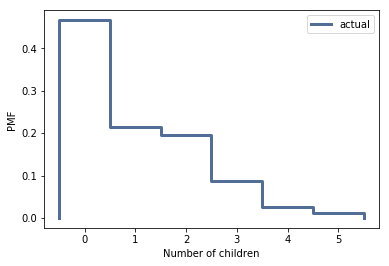
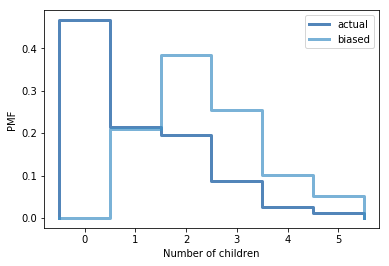

[Think Stats Chapter 3 Exercise 1](http://greenteapress.com/thinkstats2/html/thinkstats2004.html#toc31) (actual vs. biased)

We construct the actual pmf for the children under 18
```python
actual = thinkstats2.Pmf(resp.numkdhh, label='numkdhh')
thinkplot.Pmf(actual)
thinkplot.Config(xlabel='Number of children', ylabel='PMF')
```
[]
\
We compute the biased distribution and we plot it
```python
biased = BiasPmf(actual, label='biased')
thinkplot.Pmf(biased)
thinkplot.Config(xlabel='Biased number of children', ylabel='PMF')
```
[]
We plot the two distribution together
```python
thinkplot.PrePlot(2)
thinkplot.Pmfs([actual, biased])
thinkplot.Config(xlabel='Number of children', ylabel='PMF')
```

[]
\
We evaluate the two different mean values
```python
actual.Mean(), biased.Mean()
```
\
(1.024205155043831, 2.403679100664282)
\
The biased mean is more than two time the actual mean.