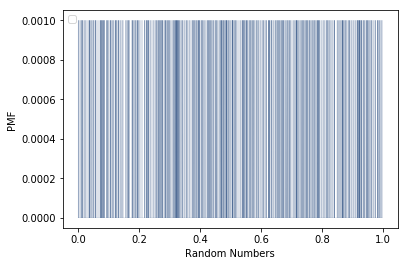
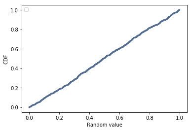

[Think Stats Chapter 4 Exercise 2](http://greenteapress.com/thinkstats2/html/thinkstats2005.html#toc41) (a random distribution)

We generate the random numbers and we plot the pmf
```python
random_numbers= np.random.random(1000)
pmf = thinkstats2.Pmf(random_numbers)
thinkplot.Pmf(pmf, linewidth= 0.1)
thinkplot.Config(xlabel='Random Numbers', ylabel='PMF')
```
[]
\
The pmf is very difficult to read, because there are a lot of different values with different frequencies.\
To provide a more effective visualization we plot the cdf instead. 
```python
cdf = thinkstats2.Cdf(random_numbers)
thinkplot.Cdf(cdf)
thinkplot.Config(xlabel='Random value', ylabel='CDF')
```
[]
\
